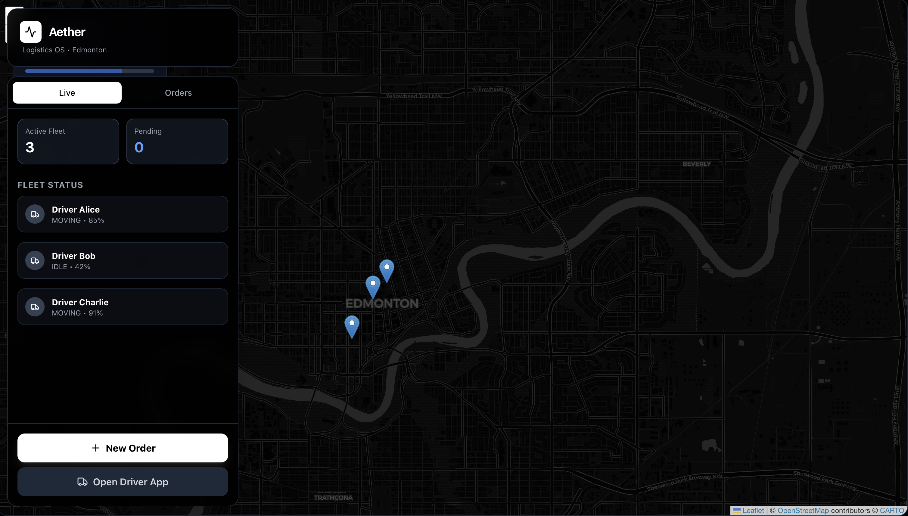

<h1 align="center">Vansh Taneja</h1>

<h3 align="center">
Software Engineer • AI Systems • Distributed Infrastructure
</h3>

<i>Designing production systems where scale, latency, and failure are first-class concerns.</i>

  

  
  

  
  
  

<h2>System Profile</h2>

<pre>
name: Vansh Taneja
role: Software Engineer (AI + Distributed Systems)
education: Computer Science (AI Option), University of Alberta
operating_mode: production-first
focus:
  - Event-driven architecture
  - Real-time decision systems
  - AI under latency constraints
</pre>

<b>I don’t build demos.</b>  a
<b>I design systems with explicit failure modes.</b>

<h2>Active System — Aether</h2>

  

<b>Aether — Real-Time Distributed Logistics Engine</b>

Dispatch is not CRUD. 
It is a streaming, stateful decision problem under strict latency constraints.

<ul>
  <li>Kafka-backed event backbone</li>
  <li>gRPC microservices with strict service contracts</li>
  <li>Redis for real-time fleet and order state</li>
  <li>PostgreSQL for durability and analytical workloads</li>
  <li>AI models embedded directly in the decision loop</li>
  <li>Operator command-center interface for live overrides</li>
</ul>

  
  
  

🔗 https://github.com/vanshtaneja23/Aether

<h2>Micro-Netflix</h2>

  

<b>Event-Driven Video Streaming Platform</b>

<ul>
  <li>Asynchronous transcoding pipelines</li>
  <li>Queue-isolated workloads</li>
  <li>Object-storage-backed scalability</li>
  <li>Container-first deployment model</li>
</ul>

🔗 https://github.com/vanshtaneja23/micro-netflix

<h2>SocialDistribution — CMPUT 404</h2>

<b>Federated Social Networking (ActivityPub-style)</b>

Multi-node, REST-first. Entries, likes, and comments flow node-to-node via inbox APIs.

<ul>
  <li>RESTful API with full spec compliance; pagination, auth, visibility (public/unlisted/friends)</li>
  <li>Node-to-node federation: follow requests, entries, likes, comments pushed to remote inboxes</li>
  <li>PostgreSQL-backed; single-server-per-node deployment model</li>
  <li>Every endpoint tested and documented; interop with multiple teams' nodes</li>
</ul>

  
  

<h2>Tartan Smart Home — CMPUT 402</h2>

<b>Software Quality • Java REST Service • IoT Platform</b>

Evaluating and extending an existing Java service layer. Quality and testability over new features.

<ul>
  <li>Java, Dropwizard/Jersey — RESTful state and update APIs for smart-home nodes</li>
  <li>Integration with IoT controller and historian; state consistency and failure recovery</li>
  <li>Focus: testing, requirements validation, and improving a legacy codebase</li>
</ul>

  
  

🔗 https://github.com/cmput402/w26-tartan-w001

<h2>Experience</h2>

<b>Co-Founder & Full-Stack / AI Engineer — Nexus</b> <i>Oct 2025 – Present · Edmonton, AB</i>
<ul>
  <li>Production FastAPI backend with PostgreSQL (Supabase), JWT auth, RBAC, 35+ REST endpoints; cloud file storage; structured logging and monitoring</li>
  <li>GPT-4o with guardrails (rate limiting, PII filtering, retry logic); LLM inference pipeline with token/latency monitoring; reduced manual support workload by ~80%</li>
  <li>End-to-end automation: email ingestion → context retrieval → generation; async workers; webhook-based multi-channel (web, email via AWS SES/SendGrid)</li>
  <li>React (Next.js) admin dashboards, real-time updates, threaded email view</li>
  <li>Agile sprints, code reviews, full lifecycle; CI/CD (GitHub Actions), AWS (EC2/SES)</li>
</ul>

<b>Software Development Intern — Vita Actives</b> <i>May 2024 – Aug 2024 · Remote</i>
<ul>
  <li>Flask microservices on AWS EC2 (Docker, Nginx); reduced manual reporting time by ~30%</li>
  <li>REST APIs with JWT auth and structured logging; React + PostgreSQL dashboards for 100+ internal users</li>
  <li>CI/CD (GitHub Actions): automated testing (Jest/PyTest), Docker builds, deployments</li>
  <li>Monitoring and health checks; large reduction in unhandled production errors</li>
  <li>Scrum team: code reviews, API docs (Jira, Git); investigated and fixed defects</li>
</ul>

<b>Data Science Intern — Vita Actives</b> <i>May 2023 – Aug 2023 · Remote</i>
<ul>
  <li>Predictive models (Random Forest, XGBoost) for demand and inventory planning; time-series for restocking and trend forecasting</li>
  <li>Customer segmentation (K-Means, DBSCAN); identified high-value user cohorts</li>
  <li>NLP (tokenization, sentiment analysis) on customer feedback; extracted product insights</li>
</ul>

<b>Research Assistant — Data Engineering</b> <i>Feb 2025 – Mar 2025 · University of Alberta (ACLMR)</i>
<ul>
  <li>Python ETL: 50M+ records from SEMrush API across 6,000+ domains; checkpointing and fault-tolerant batch jobs</li>
  <li>Partitioning (US, CA, ROW) around API rate limits; schema validation, cleaning, serialization for downstream ML</li>
  <li>Validation scripts for data integrity and SQL analytics; collaborated with faculty on schemas and research goals</li>
</ul>

<b>Teaching Assistant — Introduction to AI (CMPUT 261)</b> <i>Winter 2026 · University of Alberta</i>
<ul>
  <li>Labs for 200+ students: search algorithms, reinforcement learning, Python; mentored on algorithms and code quality</li>
  <li>Code review for correctness and efficiency; structured feedback; clear explanation of complex AI concepts</li>
</ul>

<h2>Engineering Telemetry</h2>

  
  

<h2>Toolchain</h2>

  

  

<h2 align="center">Recruiter Note</h2>

I operate with ownership. 
I design for scale and failure. 
I ship production systems.

<b>Roles:</b> 
Software Engineering Intern • Backend / Distributed Systems • AI Engineer

<b>Contact:</b> vanshtaneja23@gmail.com

<i>Serious systems. Real constraints. No theatrics.</i>

